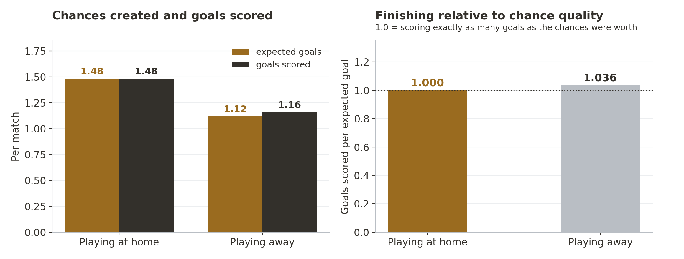
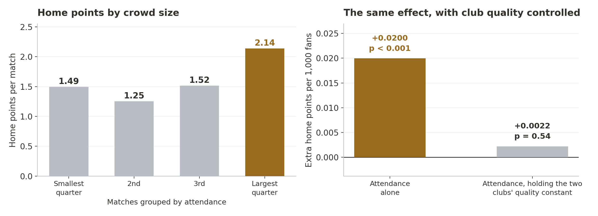
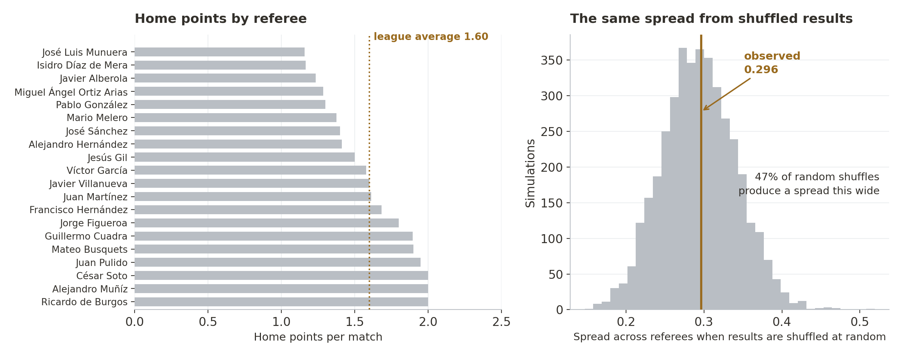
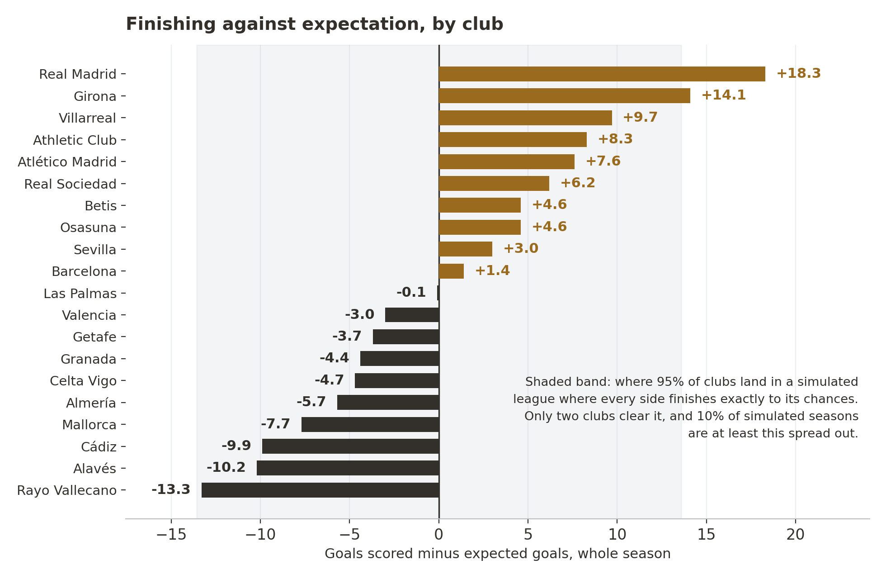

# Where Home Advantage in La Liga Comes From

> Every match of the 2023–24 La Liga season, trying to locate an effect everyone agrees exists.

`Python` · `statsmodels` · `scikit-learn` · `permutation testing`

## The question

Home teams in La Liga took **1.60 points a match** last season. Away teams took **1.12**. Nobody disputes the gap is there. The harder question is what it's made of.

Two things get muddled constantly, and they need separating:

- **Where the advantage shows up.** Do home teams create more chances, or take the same chances better?
- **What causes it.** Crowd? Referees? Travel? Familiarity with the pitch?

All 380 matches of the season, with expected goals, attendance and the referee for every one. It answers the first question fairly clearly and the second only partly.

## Finding 1: home teams get more chances, they don't take them better

There are only two ways to score more: create more chances, or finish the ones you get.



**Chances.** At home, teams create **1.484 expected goals** a match. Away, **1.121**. A large gap, and very unlikely to be chance.

**Finishing.** At home, teams score 1.000 goals for every 1.000 expected. Away, 1.036. Away sides look fractionally sharper, but the range the data supports runs from −0.151 to +0.079, which includes zero. Finishing is about the same home and away.

So the advantage is **territorial**. Playing at home gets teams into better positions more often, without changing much about what happens once they're there.

Worth being careful: that locates the effect, it doesn't explain it. "Home teams get into better areas" describes the pattern. It could come from visitors' travel fatigue, familiarity with the pitch, more adventurous home tactics, referee decisions that don't show up in results, or a crowd effect too subtle for attendance to capture. The next two sections rule two of those out. They don't identify the winner.

## Finding 2: the crowd looks like the answer, until you notice who's playing

Sort all 380 matches by attendance and split them into four groups.



In the biggest quarter of crowds, home teams took **2.14 points a match**. In the smallest, **1.49**. Every extra thousand fans looks worth about 0.02 home points.

The problem is which clubs have the biggest stadiums. The Bernabéu, the Camp Nou, the Metropolitano — the same clubs that would win most of those matches in an empty ground. A club's points total and its average home crowd move together at **r = 0.68**.

So the crowd needs testing with the teams held constant. Add the quality gap between the two sides and attendance falls to **0.0022 points per thousand fans (p = 0.54)**. Nothing you'd act on.

A second check points the same way. Instead of comparing clubs to each other, compare each club to **itself**: does Sevilla do better when the Sánchez-Pizjuán is fuller than its own average? If anything, slightly worse. The reason is mundane — a club's biggest gate is usually the day Real Madrid come to town.

What this shows is narrower than "crowds don't matter." It shows that **attendance, as recorded here, carries no information once you know who's playing.** Attendance is a blunt proxy: it can't see noise, atmosphere, or how much of the ground is home support. A crowd effect could exist and be invisible to it.

**Meanwhile the home edge itself survives.** Hold both clubs' quality constant and an evenly matched home side still creates about **0.364 more expected goals**. Same as the raw average, so the advantage isn't something only big clubs generate.

## Finding 3: a referee table that looks damning and probably isn't

Rank the twenty referees by home points per match. Bottom: José Luis Munuera, **1.16**. Top: Ricardo de Burgos, **2.00**. That looks like a story about who favours the home side.



Each referee worked about nineteen matches. To see whether a spread that wide means anything, take every result in the season, deal them out to the same referees at random, and measure again. Repeat 4,000 times.

Random shuffling produces an average spread of **0.294**. The real spread is **0.296**. About **half of random shuffles come out at least this wide**.

Nineteen matches isn't enough to separate a referee from luck. That doesn't prove no referee favours home teams — it means one season of *results* can't detect it. Cards and penalties would be more sensitive, and they aren't in this data.

## Finding 4: the biggest numbers in the season, and what they can support



Real Madrid scored **18.3 more goals** than their chances were worth. Girona, **14.1**. At the other end Rayo Vallecano finished **13.3 short**. A 31-goal spread that reads like a ranking of who can finish.

Same test as the referees. Simulate a league where nobody has any finishing ability, where every chance goes in at exactly the rate its xG says, and play 4,000 seasons of it. Pure luck produces an average spread of **6.93** goals. The real one is **8.49**. Nearly one simulated season in ten is at least this spread out.

The real table sits inside what luck alone generates. That isn't proof finishing skill doesn't exist — it means one season of twenty clubs can't demonstrate it.

The practical use is still real, just different from what the table appears to offer. If Real Madrid's +18.3 is largely variance, the sensible expectation is that **it regresses** — useful before setting next season's baseline, or paying a premium for a striker off one hot year. What the data won't support is ranking clubs on finishing ability.

## What the season supports

| | |
|---|---|
| **Home advantage is real, and territorial** | Reasonably firm. +0.364 xG a match holding both clubs' quality constant, with flat conversion |
| **The crowd explains it** | Not supported. Attendance carries no signal once quality is controlled, though it is a crude proxy |
| **Referees explain it** | Not detectable. Nineteen matches each is too few to separate from chance |
| **Home sides finish better** | Not supported. Conversion is statistically indistinguishable |
| **What causes the territorial edge** | Open. Travel, familiarity and tactics are all live candidates |

Three of these follow the same shape: a table that looks convincing, and a null model that reproduces it. On one season of one league, asking what a number would look like if the effect didn't exist matters more than the choice of model.

## What I'd do next

1. **Add travel.** Distance travelled and days of rest would test the most plausible remaining cause of the territorial edge. Both exist and neither is in this file.
2. **Get goal timings.** They'd restore the original first-goal question, and allow a better version of it: does an early opener matter more than a late one?
3. **Cards and penalties by referee.** Results are blunt for detecting officiating bias. Decisions are far more sensitive.
4. **More than one season.** Almost every null here really means "not detectable in 380 matches." Five seasons would settle several either way.
5. **A cleaner quality control.** Season points are computed from the same matches being modelled, which is circular. Pre-season wage bills or market values would be independent.

<details>
<summary><b>Data and method, including a column that doesn't mean what it says</b></summary>

All 380 matches of the 2023–24 La Liga season, with expected goals for both sides, attendance, venue and referee.

Home advantage splits into chance creation and conversion by comparing xG against goals on each side. The xG gap uses a paired t-test (p ≈ 2×10⁻¹⁰). The conversion gap uses a 4,000-sample bootstrap, since a ratio of two sums has no clean closed-form interval.

The crowd analysis regresses home points and the home xG edge on attendance, first alone and then alongside a club-quality gap built from the difference in the two sides' season points. The within-club version replaces raw attendance with each match's deviation from that club's own home average, so club identity can't be doing the work. The home edge holding both clubs constant is +0.364 xG, p ≈ 4×10⁻¹³.

Two results are checked against an explicit null rather than a p-value threshold. The referee test shuffles results across referees 4,000 times, keeping fixture counts fixed. The finishing test simulates 4,000 seasons where goals are Poisson draws around each match's xG. Both ask the same thing: before reading a ranking, what would it look like if nothing were going on?

**On the `first_goal` column.** The data ships a column with that name. It does not record who scored first. Across all 380 matches it never once names the home team: it holds the away side's name in 249 rows and is blank in 131, and it's blank almost exactly when the away team failed to score.

The original cleaning filled those blanks with a rule that's sound in isolation — if one side was shut out, the side that scored obviously scored first. The problem is which matches that rule can reach. A home team's first goal is only recoverable when the away side scored zero, so "home scored first" ends up existing **only for home clean sheets**, 98 of the 100 recovered matches. A team that concedes nothing at home doesn't lose, so the 98% home win rate that follows restates which matches were selected. The failure is selection, not arithmetic, which is why it's easy to miss.

The same selection shows elsewhere: 74 of 76 drawn matches end up labelled "away scored first," and the home-scored-first rate lands at 29% when the true figure across leagues is nearer 55%. `data_quality_audit.py` reproduces every number here.

**Limits.** One league, one season, so every null should read as "not detectable at this sample size" rather than "absent." Season points as a quality control come from the same matches being modelled. The referee test covers home bias in results only. Nothing here separates travel, familiarity and crowd as competing causes.

</details>

## Where this started

A team project testing whether scoring the first goal wins you the match. The question is a good one and the team set it up properly: clear hypothesis, real data, and a limitations slide that flags the risk of selection bias. The data assembly holds up completely — everything above runs on the same 380 matches.

It ran aground on the data rather than the method. The `first_goal` column doesn't record what its name says, and the details are in the methodology note above. Goal timings simply aren't in this file, so the original question can't be answered with it. That's what redirected the work toward what the season *can* answer. The original report and deck are in `original-project/`.

## Running it

```bash
pip install -r requirements.txt
python3 laliga_analysis.py
python3 data_quality_audit.py
```

Both print every number quoted above, so the figures and claims regenerate from the committed data.

Team project from my master's at USC, with Jayson, Aman and Vincent. I led the modelling; the rebuild here is mine.
